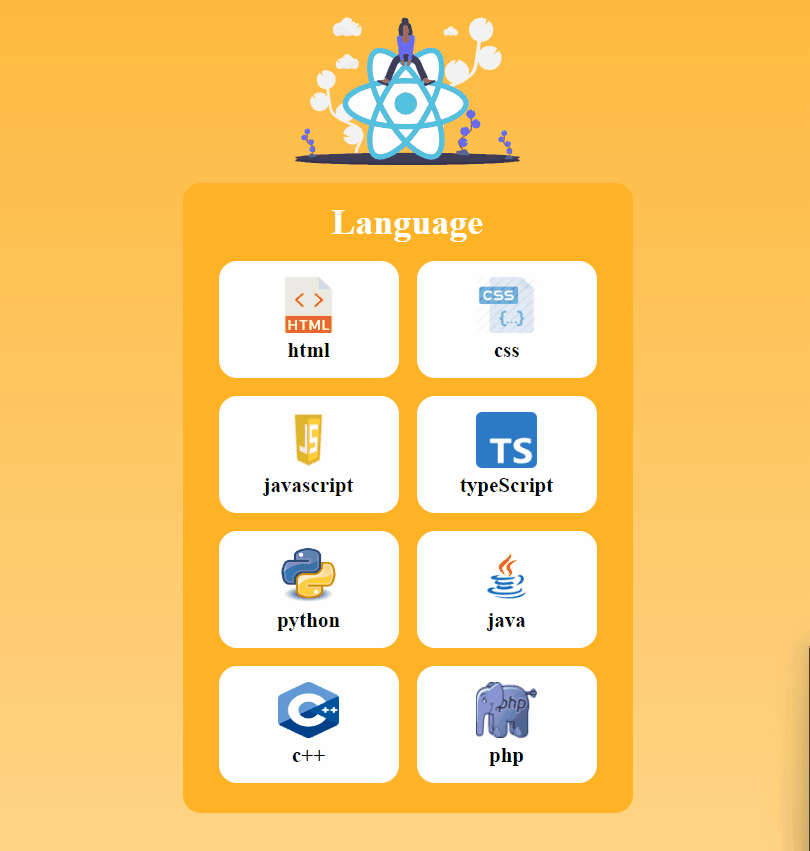

## Check The Live Website ➡️ [Live Website](https://osmankoyuncuu.github.io/react-language-cards/)

## Animation of the Website

## Description

Project aims to create Language Cards App.

## Project Skeleton

    react-language-cards
    |
    ├── public
    │     └── index.html
    │     └── favicon.ico
    ├── src
    │    ├── assets
    │    │      └── (images)
    │    ├── components
    │    │       └── cards
    │    │           └── Card.css
    │    │           └── Card.js
    │    ├── helper
    │    │       └── data.js
    │    ├── App.js
    │    ├── App.css
    │    ├── index.js
    │    └── index.css
    ├── .gitignore
    ├── language-cards.gif
    ├── package.json
    ├── README.md
    └── yarn.lock

## Overview

I mastered HTML, CSS and React features in this project. You can see the visual representation of the website above.
